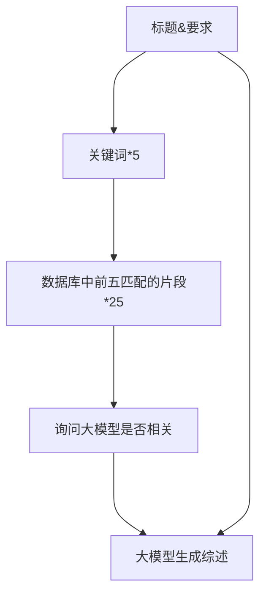

# 数据库引论实验报告 -- 论文写作助手算法优化方案

| Student Name    | Student ID  | Date     |
| --------------- | ----------- | -------- |
| Zecyel (朱程炀) | 23300240014 | 2025.5.19 |

## 1. 构建数据集

最终结果：找了 51 篇论文，生成了 204 条问答数据。

首先，从我这学期阅读的文献中找了 51 篇质量较高的论文，所有论文均来自于 ArXiv，论文的时间跨度从 1706（Attention is all you need）到 2504，中位数是 2402，是个比较新的数据库。

也可以使用自动脚本 arxiv.py，自动从 arxiv 上爬取某个领域最新的论文。

之后，让 DeepSeek 阅读了每一篇文献，然后对每个文献提出两个概括性的问题（不一定和原来的论文有 100% 的相似度，比如 RWKV 的工作就可能提出“RNN 的发展历程”这样的问题），要求一个中文问题一个英文问题。

之后使用参数最好的一组算法，把模型从 Qwen 换成 DeepSeek，生成对应的参考文献和回答（中英都有，所以问答数据要翻倍），即可得到质量很高的一个数据库。

什么，你问我怎么在没有数据集的情况下知道哪个参数比较好？

当然是生成数据集 -> 搜索参数 -> 生成数据集 -> 搜索参数，如此循环往复。（每生成一次回答需要向 DeepSeek 发送 28 次请求，102 个问题就是 3k 次请求，还带上了参考文献的部分，贵死了）

## 2. 评分系统构建

对于模型找出来的参考文献，我们把 DeepSeek 认为需要引用的文献作为 ground truth，然后计算它的准确率、召回率和 F1 值。

对于模型写出来的内容，我们使用 BertScore，将模型生成的结果和 DeepSeek 生成的结果进行相似度评分。

## 3. 算法优化与消融

### 3.0 算法实现

### 3.1 优化模型论文选择

实验发现，模型的召回率非常高，但是准确率较低。原因是 DeepSeek 通常只选择相关性非常高的内容，而 Qwen 则宽松地多，这一点可以通过 prompt 调优来实现。（本实验在切片优化之后）

调整 prompt 前：

调整 prompt（“相关”改成“强相关”）后：

可以看到，在 recall 基本没有变化的情况下，提高了 precision。

但是在真实的论文写作场景中，多引用相关的论文或许问题不大，可以手动剔除，而且模型的召回率相当的高，是我们希望看到的结果。

### 3.2 优化数据切分

原先的数据将论文转换成字符串后，每 512 个字符切片，可能导致重要的信息被阶段。现在在两个 chunk 之间添加了 64 字符的 overlap，结果有较好的提高，而且准确率和召回率也有很高的提升。（终端信息，当时直接关了没保存）

### 3.3 去除引用之后再比较 BertScore

没啥影响。

### 3.4 优化超参数

比如切片大小，关键词数量，rag 检索中的检索出的条目数量。

不搜索这些参数，因为一方面没有任何技术含量，而且另一方面很可能极大地损失泛化性（毕竟我只有这一个数据集，而且我读的论文范围还是太窄了）。

### 3.5 换用更强大的模型

只是好奇更强的模型能力如何，于是使用了钞能力购买了 o3，发现强了不是一点半点。（太贵了！太贵了！抽样测试之后仍然花了两百多块）

其实我主观感觉 o3 的英文写作能力要比中文好特别多，可能是因为基线选用的是 DeepSeek，而且使用的是 BertScore 相似度比较，导致在图中体现不出来。或许应该用 o3 来生成英文的基线。

## 4. 创新点

五月生了一个月的病，实在没时间做创新点了。主要就是这一套完整的工作流：定时从 ArXiv 下载论文 -> 生成问题 -> 生成综述内容和参考文献，而且可以挂机运行，用 tqdm 写了个进度条。

和在 fnlp 实验室写的自动化脚本差不多，如果要加邮件自动提示进度也可以加，但是由于这个脚本只需要三个小时就能拿 102 条数据蒸馏一遍 DeepSeek，所以没写。这几天一直在“去实验室 -> 检查数据是否符合预期 -> 调参 -> 在服务器上启动下一个脚本”的循环。

会在这门课结束后开源前后端代码、算法优化相关的实验代码和数据集（目前是闭源）。

综述写作助手（前后端）：https://github.com/34-3021/Overview-Writer

算法优化部分：https://github.com/34-3021/RAG-Optimizer
